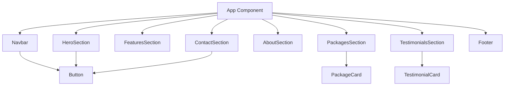
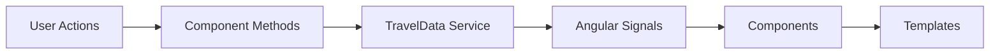
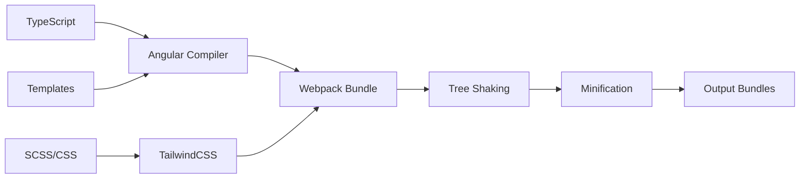

# 🏗️ Architecture Documentation - Trilha Serena

> **Sistema:** Agência de Viagens Digital  
> **Versão:** v1.0.0  
> **Framework:** Angular v20.1.0  
> **Última Atualização:** 2025-01-17

---

## 🎯 Visão Geral Arquitetural

### 🏛️ Padrões Arquiteturais

- **Component-Based Architecture** - Decomposição em componentes reutilizáveis
- **Feature-Driven Structure** - Organização por domínios de negócio
- **Reactive Programming** - Angular Signals para estado reativo
- **Separation of Concerns** - Camadas bem definidas (UI, Service, Data)

### 🎨 Design Principles

1. **Single Responsibility** - Cada componente tem uma responsabilidade
2. **Open/Closed** - Extensível sem modificação
3. **Dependency Inversion** - Abstrações via interfaces
4. **Don't Repeat Yourself** - Componentes reutilizáveis
5. **KISS (Keep It Simple)** - Simplicidade na implementação

---

## 📁 Estrutura de Diretórios

```
src/app/
├── 🏠 app.ts                     # App root component
├── 🏠 app.html                   # App template
├── 🏠 app.css                    # App global styles
├── 🏠 app.config.ts              # App configuration
│
├── 🧭 core/                      # Core module
│   └── components/               # Essential components
│       ├── navbar/              # Navigation component
│       │   ├── navbar.ts
│       │   ├── navbar.html
│       │   └── navbar.css
│       └── footer/              # Footer component
│           ├── footer.ts
│           ├── footer.html
│           └── footer.css
│
├── 🔗 shared/                    # Shared resources
│   ├── components/              # Reusable components
│   │   └── button/             # Generic button
│   │       ├── button.ts
│   │       ├── button.html
│   │       └── button.css
│   ├── interfaces/             # TypeScript interfaces
│   │   └── travel.interfaces.ts
│   └── services/               # Shared services
│       └── travel-data.ts      # Data management
│
├── 🎯 features/                 # Feature modules
│   ├── landing/                # Landing page features
│   │   ├── hero-section/
│   │   ├── features-section/
│   │   ├── packages-section/
│   │   ├── about-section/
│   │   ├── testimonials-section/
│   │   └── contact-section/
│   ├── travel-packages/        # Package domain
│   │   └── package-card/
│   └── testimonials/           # Testimonials domain
│       └── testimonial-card/
│
└── 📁 assets/                   # Static assets
    └── images/                 # Image files
```

---

## 🔧 Component Architecture

### 🏗️ Component Hierarchy



### 🎨 Component Types

#### 🧭 **Core Components** (`core/components/`)
- **Purpose:** Essential app-level components
- **Lifecycle:** Singleton, loaded on app start
- **Examples:** Navbar, Footer, App Shell

```typescript
// Example: Navbar component
@Component({
  selector: 'app-navbar',
  imports: [CommonModule, LucideAngularModule, Button],
  templateUrl: './navbar.html',
  styleUrl: './navbar.css'
})
export class Navbar {
  @Input() isScrolled = false;
  // Component logic
}
```

#### 🔗 **Shared Components** (`shared/components/`)
- **Purpose:** Reusable UI components
- **Lifecycle:** Imported where needed
- **Examples:** Button, Modal, Form Controls

```typescript
// Example: Button component with variants
@Component({
  selector: 'app-button',
  imports: [CommonModule],
  templateUrl: './button.html',
  styleUrl: './button.css'
})
export class Button {
  @Input() variant: 'primary' | 'secondary' = 'primary';
  @Input() size: 'sm' | 'md' | 'lg' = 'md';
  @Input() disabled = false;
  @Input() fullWidth = false;
  
  clicked = output<void>();
}
```

#### 🎯 **Feature Components** (`features/`)
- **Purpose:** Business logic components
- **Lifecycle:** Feature-specific
- **Examples:** Landing sections, Package cards

```typescript
// Example: Package card with business logic
@Component({
  selector: 'app-package-card',
  imports: [CommonModule, LucideAngularModule, Button],
  templateUrl: './package-card.html',
  styleUrl: './package-card.css'
})
export class PackageCard {
  @Input({ required: true }) package!: Package;
  
  onRequestItinerary() {
    // Business logic for itinerary request
  }
}
```

---

## 📊 Data Flow Architecture

### 🔄 State Management



#### 📡 **Service Layer** (`shared/services/`)

```typescript
@Injectable({ providedIn: 'root' })
export class TravelData {
  // Private signals for internal state
  private packagesSignal = signal<Package[]>([...]);
  private testimonialsSignal = signal<Testimonial[]>([...]);
  
  // Public readonly getters
  get packages() {
    return this.packagesSignal.asReadonly();
  }
  
  get testimonials() {
    return this.testimonialsSignal.asReadonly();
  }
  
  // State update methods
  addPackage(pkg: Package) {
    this.packagesSignal.update(packages => [...packages, pkg]);
  }
}
```

#### 🎯 **Component Consumption**

```typescript
export class PackagesSection {
  private travelDataService = inject(TravelData);
  
  // Reactive data consumption
  packages = this.travelDataService.packages;
}
```

### 🔗 Interface Definitions

```typescript
// shared/interfaces/travel.interfaces.ts
export interface Package {
  id: number;
  title: string;
  description: string;
  image: string;
  days: string;
  regime: string;
  price: string;
  features: string[];
}

export interface Testimonial {
  name: string;
  role: string;
  text: string;
  rating: number;
}
```

---

## 🎨 Styling Architecture

### 🎯 CSS Strategy

- **Utility-First:** TailwindCSS para styling rápido
- **Component Isolation:** Scoped styles por componente
- **Design System:** Tokens centralizados via CSS variables
- **Responsive:** Mobile-first approach

### 🌈 Design Tokens

```css
/* Global CSS Variables */
:root {
  --brand-primary: #your-primary-color;
  --brand-secondary: #your-secondary-color;
  --brand-accent: #your-accent-color;
  --brand-neutral-100: #your-light-gray;
  --brand-neutral-900: #your-dark-gray;
}
```

### 📱 Responsive Strategy

```html
<!-- Mobile-first responsive classes -->
<div class="grid grid-cols-1 md:grid-cols-2 lg:grid-cols-3 gap-4">
  <!-- Content adapts to screen size -->
</div>
```

---

## 🚀 Build & Deployment Architecture

### 📦 Build Pipeline



### 🗂️ Bundle Structure

```
dist/trilha-serena/
├── main-[hash].js          # Application code
├── polyfills-[hash].js     # Browser polyfills
├── styles-[hash].css       # Compiled styles
├── assets/                 # Static assets
└── index.html             # Entry point
```

### ⚡ Performance Optimizations

1. **Tree Shaking** - Eliminação automática de código não usado
2. **Code Splitting** - Preparado para lazy loading
3. **Asset Optimization** - Imagens e recursos otimizados
4. **Bundle Analysis** - Monitoramento de tamanho de bundle

---

## 🧪 Testing Architecture

### 🎯 Testing Strategy (Planejado v1.1.0)

```
Testing Pyramid:
    🔺 E2E Tests (Cypress)
   🔻🔻 Integration Tests
  🔻🔻🔻 Unit Tests (Jest/Jasmine)
```

#### 🧪 **Unit Testing**

```typescript
// Example test structure
describe('Button Component', () => {
  beforeEach(() => {
    TestBed.configureTestingModule({
      imports: [Button]
    });
  });
  
  it('should emit clicked event', () => {
    // Test component behavior
  });
});
```

#### 🔗 **Integration Testing**

```typescript
// Test component integration
describe('PackagesSection Integration', () => {
  it('should display packages from service', () => {
    // Test service integration
  });
});
```

---

## 🔒 Security Architecture

### 🛡️ Security Measures

1. **Input Validation** - Formulários validados
2. **XSS Prevention** - Angular sanitization automática
3. **HTTPS Only** - Comunicação segura obrigatória
4. **Content Security Policy** - Headers de segurança

### 🔐 Data Protection

```typescript
// Example: Form validation
export class ContactSection {
  formData: FormData = {
    name: '',
    email: '',
    phone: '',
    message: ''
  };
  
  handleSubmit() {
    // Validation and sanitization
    if (this.isValidForm()) {
      this.submitForm();
    }
  }
}
```

---

## 📈 Scalability Considerations

### 🚀 Current Capabilities

- ✅ **Component Reusability** - Easily extendable
- ✅ **Feature Isolation** - Independent development
- ✅ **Type Safety** - Full TypeScript coverage
- ✅ **Performance** - Optimized bundle size

### 🔮 Future Enhancements (Roadmap)

1. **Micro-Frontend** - Independent deployable modules
2. **State Management** - NgRx for complex state
3. **API Integration** - REST/GraphQL clients
4. **PWA Features** - Offline functionality
5. **SSR/SSG** - Angular Universal for SEO

---

## 🔧 Development Guidelines

### 📋 Component Creation Checklist

- [ ] Single responsibility principle
- [ ] TypeScript strict typing
- [ ] Proper input/output definitions
- [ ] Responsive design implemented
- [ ] Accessibility considerations
- [ ] Unit tests planned
- [ ] Documentation updated

### 🎯 Best Practices

1. **Naming Conventions**
   - PascalCase for components
   - camelCase for properties/methods
   - kebab-case for selectors

2. **File Organization**
   - One component per file
   - Co-located templates and styles
   - Barrel exports for modules

3. **Type Safety**
   - Strict TypeScript mode
   - Interface definitions
   - Generic types where appropriate

---

## 📚 Additional Resources

### 🔗 Documentation Links

- [Angular Architecture Guide](https://angular.dev/guide/architecture)
- [Component Interaction](https://angular.dev/guide/component-interaction)
- [Angular Signals](https://angular.dev/guide/signals)
- [Standalone Components](https://angular.dev/guide/standalone-components)

### 🛠️ Development Tools

- **Angular DevTools** - Browser extension for debugging
- **Angular CLI** - Code generation and build tools
- **TypeScript** - Static type checking
- **ESLint** - Code quality enforcement
- **Prettier** - Code formatting

---

<div align="center">

**🏗️ Arquitetura projetada para escalabilidade e manutenibilidade**

</div>
